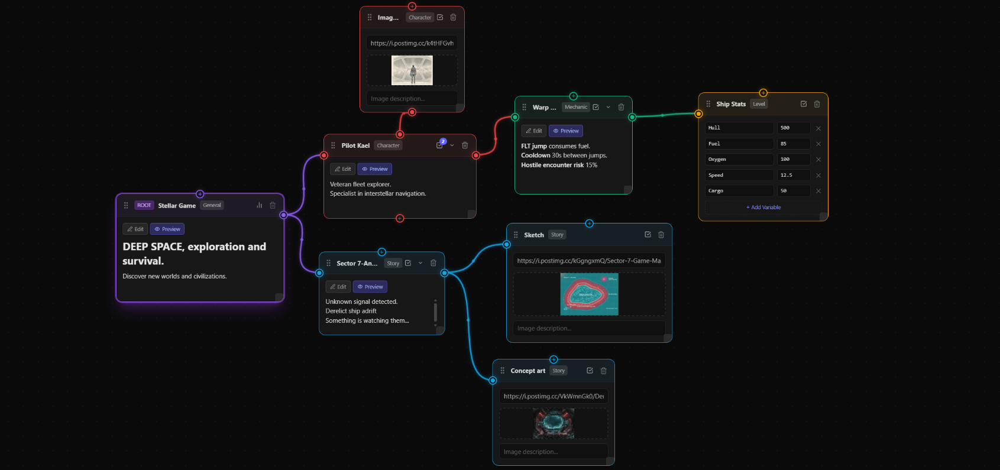

# Grapken — Game Design Blueprint Tool

> Your game lives in your head. Build your game's Blueprint.

**Stop doing paperwork. Start building your legacy.**

A visual node-based editor for creating Game Design Documents. No account. No server. Runs entirely in your browser.

[](https://www.gnu.org/licenses/agpl-3.0)
[](https://cla-assistant.io/byronrosas/grapken-core)



---

## What is Grapken?

Grapken is a **visual node-based editor** for creating Game Design Documents (GDDs). Instead of writing boring documents that nobody reads, design your game visually by connecting ideas, mechanics, characters, and systems on an infinite blueprint.

Built in the trenches — by a dev who hated ticket trackers and loved game jams. Designed so your head doesn't explode when there are 24 hours left on the clock.

All data lives in `localStorage`. Nothing leaves your browser.

---

## Use Cases

| What you're designing | How Grapken helps |
|---|---|
| **Game Design Documents (GDDs)** | Visualize your entire game architecture on a single blueprint instead of a flat doc |
| **Character Design** | Connect characters to their abilities, stats, and story arcs |
| **Level Design** | Map out level progression, unlock conditions, and dependencies |
| **Economy Systems** | Design and balance in-game economies — currencies, sinks, sources — visually |
| **Story Branching** | Plot narrative branches, choices, and consequences as a connected graph |
| **System Architecture** | Sketch how your mechanics interact before writing a single line of code |

---

## Features

- **Infinite blueprint** — pan, zoom, drag widgets freely
- **Connected widgets** — link any node to any other via typed ports
- **Widget types** — Character, Mechanic, Level, Story, UI, Economy, Audio, Scene, Task, Image, Markdown, and more
- **Task system** — each widget has its own task list with estimates and priorities
- **Forecasting** — velocity tracking and scope-creep detection built in
- **Templates** — define once, reuse everywhere; template changes propagate to all instances
- **Minimap** — bird's-eye navigation for large blueprints
- **Export** — Markdown, PDF, PNG, and `.grapken` project files
- **100% offline** — zero backend, zero account, zero telemetry
- **No lock-in** — your data is plain JSON inside the `.grapken` format; open source and self-hostable

---

## Tech Stack

| Layer | Technology |
|---|---|
| Framework | React 19 + Vite |
| Language | TypeScript 5 |
| Styling | Tailwind CSS 4 |
| State | Zustand 5 (persisted to `localStorage`) |
| Routing | React Router 7 |
| Runtime | Bun |

---

## Getting Started

**Prerequisites:** [Bun](https://bun.sh) (or Node.js ≥ 20 with npm/pnpm)

```bash
# 1. Clone
git clone https://github.com/byronrosas/grapken-core.git
cd grapken-core

# 2. Install
bun install

# 3. Run
bun run dev
```

Open [http://localhost:5173](http://localhost:5173) — the editor loads immediately, no setup required.

### Other commands

```bash
bun run build      # Production build → dist/
bun run preview    # Preview the production build locally
bun run typecheck  # TypeScript check without emitting files
bun run lint       # ESLint
```

### Self-hosting

The production build outputs a fully static site to `dist/`. Serve it with any static host (Nginx, Caddy, GitHub Pages, Vercel, Cloudflare Pages, etc.):

```bash
bun run build
# → deploy dist/ to your host
```

No server-side runtime needed.

---

## Project Structure

```
src/
├── app/
│   ├── page.tsx          # Main editor (route /)
│   ├── landing/          # Marketing page (route /landing)
│   ├── terms/            # Terms of Service
│   ├── privacy/          # Privacy Policy
│   └── globals.css
├── components/           # UI components (canvas, widgets, panels)
├── hooks/                # useCanvas, useConnections, useHistory, ...
├── lib/                  # Pure logic (export, stats, templates, geometry)
├── store/                # Zustand store with localStorage persistence
├── types/                # TypeScript types
└── constants/            # Widget types, context definitions, defaults
```

---

## Contributing

Contributions are welcome. Please read the guidelines below before opening a PR.

### Before you start

- Check [open issues](https://github.com/byronrosas/grapken-core/issues) — something may already be in progress
- For significant changes, open an issue first to discuss the approach

### Workflow

```bash
# Fork the repo, then:
git checkout -b feat/your-feature-name
# make your changes
bun run typecheck && bun run build  # must pass
git commit -m "feat: describe your change"
git push origin feat/your-feature-name
# open a Pull Request
```

### Contributor License Agreement

All contributors must sign the **[Contributor License Agreement](https://cla-assistant.io/byronrosas/grapken-core)** before a PR can be merged. The CLA bot will prompt you automatically on your first PR.

The CLA lets us dual-license the project (open-source core under AGPL-3.0 + a future commercial Pro product). You retain full copyright of your contribution.

---

## License

The core application is licensed under the **[GNU Affero General Public License v3.0 (AGPL-3.0)](LICENSE)**.

> TL;DR: You can use, modify, and distribute this software freely. If you run a modified version as a network service, you must release the source under AGPL-3.0. The **Grapken name and logo** are trademarks and are not covered by this license.

---

## Roadmap

Items marked `[core]` ship in this open-source repo. Items marked `[pro]` are part of **Grapken Pro**, a separate commercial product.

**Core — planned:**
- [ ] `[core]` **Search & filter** — find widgets by name, type, or tags across the blueprint ([#2](https://github.com/byronrosas/grapken-core/issues/2))
- [ ] `[core]` Keyboard shortcut reference panel([#3](https://github.com/byronrosas/grapken-core/issues/3))
- [ ] `[core]` i18n support ([#4](https://github.com/byronrosas/grapken-core/issues/4))


---

## Links

- **Live app:** [grapken.com](https://grapken.com)
- **Issues:** [github.com/byronrosas/grapken-core/issues](https://github.com/byronrosas/grapken-core/issues)
- **CLA:** [cla-assistant.io/byronrosas/grapken-core](https://cla-assistant.io/byronrosas/grapken-core)
- **Contact:** contact@grapken.com
